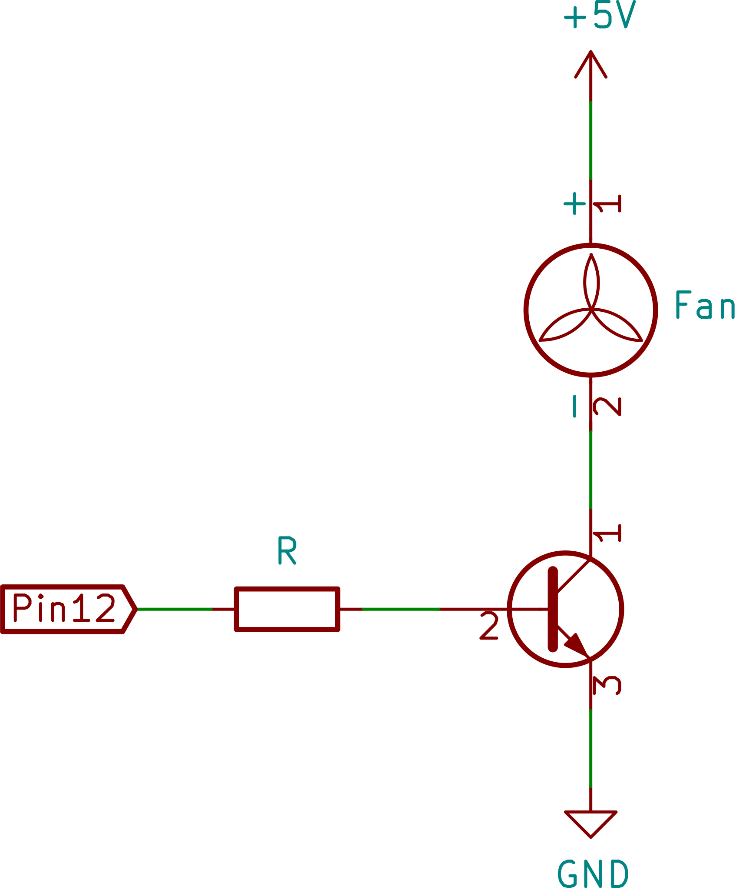

# Raspberry Pi Scripts

Raspberry Pi Scripts to manage a fan and use a power on/off button.

## Installation

### Hardware

1. The power button is a normally "open momentary push button" and has to be connected to pin 5 and 6 (GPIO3 and GND).
2. To use a fan with the Raspberry Pi you have to use a transistor and a resistor because the maximum output current of a single Raspberry's pin is 16mA. The schema below show how to connect the fan to Raspberry Pi.  
   

### Software

1. Install GPIO Zero Python library and Git:  
   `sudo apt install python-gpiozero git`
2. Install scripts:  
   `curl -Os https://raw.githubusercontent.com/dafo90/pi-scripts/master/install.sh && bash install.sh`

Done!
